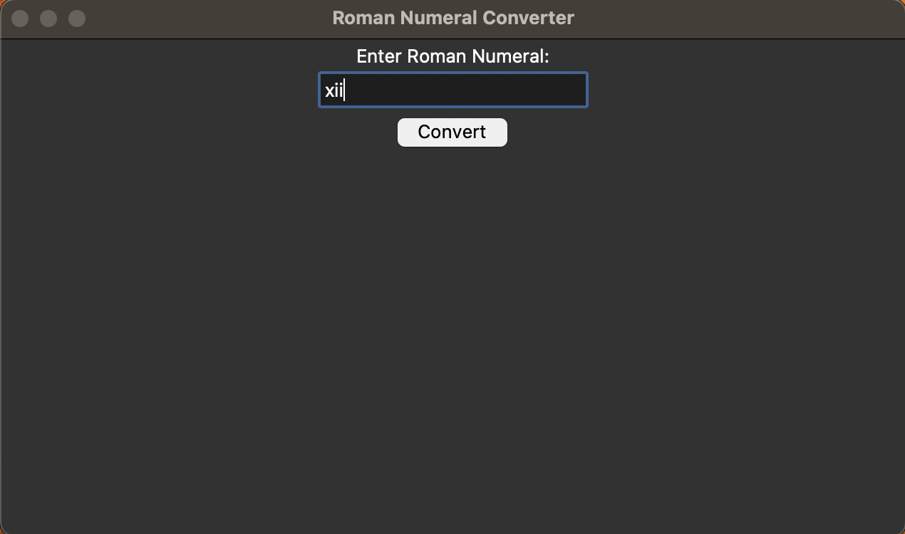

# Roman Numeral Converter App




> A simple GUI application using the Tkinter library to convert Roman numerals to their corresponding numeric values.

## Description

> The Roman Numeral Converter is a graphical user interface (GUI) application developed in Python using the Tkinter library. It allows users to input Roman numerals and obtain their equivalent integer values. The application handles invalid inputs and displays appropriate error messages when necessary.

## Features

- User-friendly GUI interface for easy input and conversion of Roman numerals.
- Converts Roman numerals to integers efficiently using a Python algorithm.
- Displays the result in a pop-up information dialog box.
- Handles invalid inputs and displays error messages using exception handling.

## Installation

> To run the application, make sure you have Python installed on your system.
> The Tkinter library comes pre-installed with Python, so there's no need for additional installations.
> In the case that you have Python installed but you don't have the Tkinter library installed, you can install it using the following command:

```pip install tk```

## Usage

- Launch the application by running the Python script:

    ```python3 roman_numeral_converter.py```

- Enter a Roman numeral in the provided text box (e.g., "XII", "IV", "IX").
- Press the "**Convert**" button or hit the "*Enter*" key to trigger the conversion.
- The result of the conversion will be displayed in a pop-up information dialog box.

## About the Author

> The Roman Numeral Converter was created by Curtis Kin Kokuloku, a computer science student at the University of Minnesota.
> Curtis is passionate about software development and enjoys building useful applications using Python and other programming languages.
